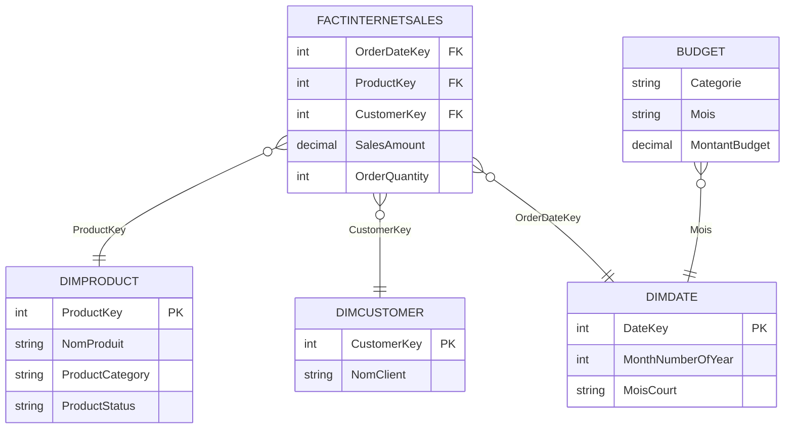

# 📊 Analyse des ventes en ligne 

> *Transformer des rapports de ventes statiques en un tableau de bord interactif permettant au Responsable des Ventes de suivre la performance par produit, client et période, en comparaison avec le budget.*

---

## ⚙️ Type de projet

- [x] Analyse SQL / Requêtage
- [x] Nettoyage de données
- [x] Dashboard / Visualisation de données
- [x] Bout en bout (recueil du besoin → données → dashboard)

---

## Table des matières
1. [Vue d'ensemble du projet](#1-vue-densemble-du-projet)
2. [Besoin métier & User Stories](#2-besoin-métier--user-stories)
3. [Objectifs](#3-objectifs)
4. [Périmètre & Outils](#4-périmètre--outils)
5. [Structure du repository](#5-structure-du-repository)
6. [Flux de données](#6-flux-de-données)
7. [Modèle de données](#7-modèle-de-données)
8. [Schéma relationnel (ERD)](#8-schéma-relationnel-erd)
9. [Analyse & Indicateurs](#9-analyse--indicateurs)
10. [Insights clés](#10-insights-clés)
11. [Recommandations](#11-recommandations)
12. [Hypothèses & Limites](#12-hypothèses--limites)
13. [Améliorations futures](#13-améliorations-futures)
14. [Livrables](#14-livrables)
15. [Auteur](#15-auteur)

---

## 1. Vue d'ensemble du projet

**Contexte :** Steven, Responsable des Ventes, constate que les rapports de ventes internet actuels sont statiques et ne permettent pas un suivi dynamique de la performance commerciale.

**Problème :** Impossible de répondre rapidement à des questions simples mais essentielles — combien a été vendu, de quels produits, à quels clients, comment cela évolue dans le temps, et comment ces résultats se comparent au budget.

**Approche :** Recueil structuré du besoin métier sous forme de user stories, restauration et nettoyage de la base AdventureWorksDW (SQL Server), modélisation en étoile, puis construction d'un dashboard Power BI intégrant les ventes réelles et le budget.

**Résultat :** Un tableau de bord interactif filtrable par produit, client et période, comparant ventes réelles et budget mois par mois.


---

## 2. Besoin métier & User Stories

Avant toute action technique, le besoin a été formalisé pour s'assurer que la solution livrée corresponde à la valeur attendue par l'entreprise.

### Vue d'ensemble de la demande

| Élément | Détail |
|---|---|
| **Rapporteur** | Steven — Sales Manager (Responsable des ventes) |
| **Valeur du changement** | Tableaux de bord visuels et amélioration du suivi des ventes |
| **Systèmes nécessaires** | Power BI, CRM |
| **Autres informations utiles** | Budget transmis au format Excel |

### Récits utilisateur (User Stories)

| N° | En tant que | Je souhaite | Afin que | Critères d'acceptation |
|---|---|---|---|---|
| 1 | Responsable des ventes | Obtenir une vue d'ensemble des ventes en ligne via un tableau de bord | Mieux identifier les clients et produits qui se vendent le mieux | Dashboard Power BI dont les données sont mises à jour quotidiennement |
| 2 | Représentant commercial | Une vue détaillée des ventes en ligne par Client | Suivre les clients performants et ceux à développer | Dashboard filtrable par client |
| 3 | Représentant commercial | Une vue détaillée des ventes en ligne par Produit | Suivre les produits les plus vendus | Dashboard filtrable par produit |
| 4 | Responsable des ventes | Un aperçu de l'évolution des ventes par rapport au budget | Suivre l'évolution des ventes dans le temps | Dashboard avec graphiques et KPI comparant résultats et budget |

> 💡 *Chaque visual du dashboard répond directement à l'un de ces récits — le filtre produit/client répond aux US 2 et 3, le comparatif temporel répond à l'US 4.*

---

## 3. Objectifs

- **Objectif principal :** Construire un dashboard Power BI permettant de suivre les ventes internet par produit, client et période, en comparaison avec le budget.
- **Objectif secondaire 1 :** Nettoyer et fiabiliser les données sources (dates, statuts produits, doublons potentiels) avant modélisation.
- **Objectif secondaire 2 :** Construire un modèle de données en étoile reliant ventes réelles et budget malgré leurs niveaux de granularité différents.
- **Objectif secondaire 3 :** Documenter le projet de bout en bout pour en faire une pièce de portfolio réutilisable.

---

## 4. Périmètre & Outils

### Périmètre

| Dimension | Détail |
|---|---|
| **Inclus** | Ventes internet (`FactInternetSales`) d'AdventureWorksDW, dimensions Produit/Client/Date, budget externe |
| **Exclu** | `FactResellerSales` (ventes via revendeurs) — non retenu car hors du périmètre défini par la demande initiale de Steven |
| **Période couverte** | 3 dernières années glissantes (actualisées depuis les dates d'origine 2010-2014) |
| **Granularité** | Transaction pour les ventes réelles ; mensuelle/catégorie pour le budget |

### Outils utilisés

| Catégorie | Outil(s) |
|---|---|
| Stockage des données | SQL Server (AdventureWorksDW) |
| Traitement des données | T-SQL |
| Visualisation | Power BI Desktop, Power Query, DAX |

---

## 5. Structure du repository

```
sales-management-data-analysis/
│
├── data/
│   └── budget/
│       └── budget.xlsx             # Fichier budget externe
├── sql/
│   ├── 01_update_dates.sql         # Mise à jour temporelle de la base
│   ├── 02_clean_dimproduct.sql     # Nettoyage table Produit
│   ├── 03_clean_dimcustomer.sql    # Nettoyage table Client
│   └── 04_clean_dimdate.sql        # Construction colonnes mois/jours en français
│
├── powerbi/
│   └── sales_dashboard.pbix        # Fichier du dashboard
│

│
├── visuels/
│   ├── Details_clients.png
│   ├── Details_produits.png
│   ├── Modelisation_etoile.png   
│   └── VueEnsemble_dashboard.png   
│       
│
└── README.md
```

---

## 6. Flux de données

```
AdventureWorksDW (SQL Server) + Fichier Budget (Excel)
      ↓
Restauration base + mise à jour des dates (script SQL)
      ↓
Nettoyage & transformation (T-SQL : DimProduct, DimCustomer, DimDate)
      ↓
Import dans Power BI (Power Query) + intégration du budget
      ↓
Modélisation en étoile + mesures DAX
      ↓
Dashboard interactif (filtres produit / client / vendeur / période)
```

1. **Source :** Base AdventureWorksDW restaurée sur SQL Server ; fichier budget au format Excel fourni séparément.
2. **Mise à jour :** Les dates de la base (2010-2014 à l'origine) ont été décalées vers la période actuelle via un script T-SQL, avec correction de deux bugs identifiés (dépendance à la langue de session SQL pour les noms de jours/mois, clés de date mal mappées sur `FactResellerSales`).
3. **Nettoyage :** Sélection des colonnes utiles, traduction des statuts produits, construction d'une colonne mois abrégé fiable pour le tri chronologique (le simple `LEFT(nom_mois, 3)` créait une collision entre juin et juillet).
4. **Transformation :** Jointures Produit ↔ Sous-catégorie ↔ Catégorie ; intégration du budget comme table séparée.
5. **Analyse :** Construction de mesures DAX (ventes réelles, écart au budget, évolution mensuelle).
6. **Sortie :** Dashboard Power BI avec filtres interactifs.

---

## 7. Modèle de données

### Table de faits : `FactInternetSales`

| Champ | Type | Description |
|---|---|---|
| `OrderDateKey` | int | Clé de date de commande |
| `ProductKey` | int | Clé produit |
| `CustomerKey` | int | Clé client |
| `SalesAmount` | decimal | Montant de la vente |
| `OrderQuantity` | int | Quantité vendue |

### Dimension : `DimProduct`

| Champ | Type | Description |
|---|---|---|
| `ProductKey` | int | Clé primaire |
| `NomProduit` | string | Nom du produit (anglais, source) |
| `Product Category` / `Sub Category` | string | Catégorie et sous-catégorie |
| `Product Status` | string | Statut traduit (Actif / Obsolète) |

### Dimension : `DimCustomer`

*(à compléter selon les colonnes finalement retenues)*

### Dimension : `DimDate`

| Champ | Type | Description |
|---|---|---|
| `DateKey` | int | Clé primaire (format AAAAMMJJ) |
| `MonthNumberOfYear` | int | Numéro du mois (1-12) |
| `MoisCourt` | string | Abréviation française du mois, construite explicitement pour éviter la collision Juin/Juillet |

### Table : `Budget`

| Champ | Type | Description |
|---|---|---|
| `Produit / Catégorie` | string | Niveau de granularité du budget (moins détaillé que les ventes réelles) |
| `Mois` | date/string | Période budgétée |
| `Montant Budget` | decimal | Montant prévisionnel |

> **Point de vigilance modélisation :** le budget est défini à un niveau plus agrégé que les ventes réelles (catégorie/mois vs transaction). La relation entre les deux tables a été construite en conséquence pour éviter les erreurs d'agrégation croisée.

---

## 8. Schéma relationnel (ERD)



---

## 9. Analyse & Indicateurs

### Approche analytique

Analyse descriptive orientée suivi de performance : comparaison des ventes réelles au budget par période, identification des produits et clients les plus performants, et mise en évidence des tendances mensuelles.

### Indicateurs clés

| Indicateur | Définition | Pourquoi il compte |
|---|---|---|
| Ventes réelles | Somme de `SalesAmount` sur `FactInternetSales` | Mesure de la performance commerciale brute |
| Écart au budget | Ventes réelles − Budget, par période | Répond directement au besoin de Steven de comparer réel vs prévu |
| Répartition par produit/client | Ventes agrégées par dimension | Répond aux User Stories 2 et 3 (vue détaillée par client/produit) |

### Méthodes utilisées

- Analyse de tendance mensuelle (ventes vs budget)
- Segmentation par produit et par client
- Mesures DAX pour le calcul dynamique des écarts au budget

---

## 10. Insights clés

*(À compléter avec 3-4 observations concrètes tirées de ton dashboard final — exemple de structure ci-dessous)*

**Insight 1 : [Titre court]**
[Ce que tu as trouvé + ce que ça implique.]

**Insight 2 : [Titre court]**
[Ce que tu as trouvé + ce que ça implique.]

**Insight 3 : [Titre court]**
[Ce que tu as trouvé + ce que ça implique.]

---

## 11. Recommandations

*(À compléter selon les insights ci-dessus)*

| Priorité | Recommandation | Basée sur | Destinataire |
|---|---|---|---|
| Haute | [À compléter] | Insight 1 | Responsable des ventes |
| Moyenne | [À compléter] | Insight 2 | Équipe commerciale |

---

## 12. Hypothèses & Limites

### Hypothèses
- Les données AdventureWorksDW ont été considérées comme complètes et fiables après nettoyage, sans validation contre un système source externe.
- Le décalage temporel appliqué aux dates suppose une équivalence directe entre les années d'origine (2010-2014) et les années actuelles pour la logique métier.

### Limites
- `FactInternetSales` ne contient pas de colonne vendeur (`SalesPersonKey`) — contrairement à `FactResellerSales`. Le filtre "par vendeur" demandé dans le mail original de Steven n'a donc pas pu être implémenté sur le périmètre Internet Sales tel quel ; c'est une limite assumée du dataset, documentée plutôt que contournée artificiellement.
- Le budget est fourni à un niveau de granularité plus agrégé (catégorie/mois) que les ventes réelles (transaction), ce qui limite la précision de la comparaison au niveau produit individuel.
- Le dashboard n'a pas pu être publié via "Publier sur le web" (fonctionnalité désactivée sur le compte scolaire utilisé) — le partage se fait donc via captures d'écran et fichier `.pbix`.

> *Documenter ces limites est volontaire : ça anticipe les questions d'un relecteur exigeant plutôt que de les subir.*

---


## 13. Améliorations futures

- [ ] Étendre l'analyse à `FactResellerSales` pour couvrir le filtre par vendeur demandé initialement
- [ ] Automatiser la mise à jour du budget via une source connectée plutôt qu'un fichier Excel statique

---

## 14. Livrables

| Livrable | Description | Emplacement |
|---|---|---|
| Scripts SQL | Mise à jour des dates et nettoyage des dimensions | [`sql/`](sql/) |
| Dashboard Power BI | Fichier source du tableau de bord | [`powerbi/sales_dashboard.pbix`](powerbi/sales_dashboard.pbix) |
| Captures d'écran | Vues du dashboard et du modèle de données | [`docs/images/`](docs/images/) |
