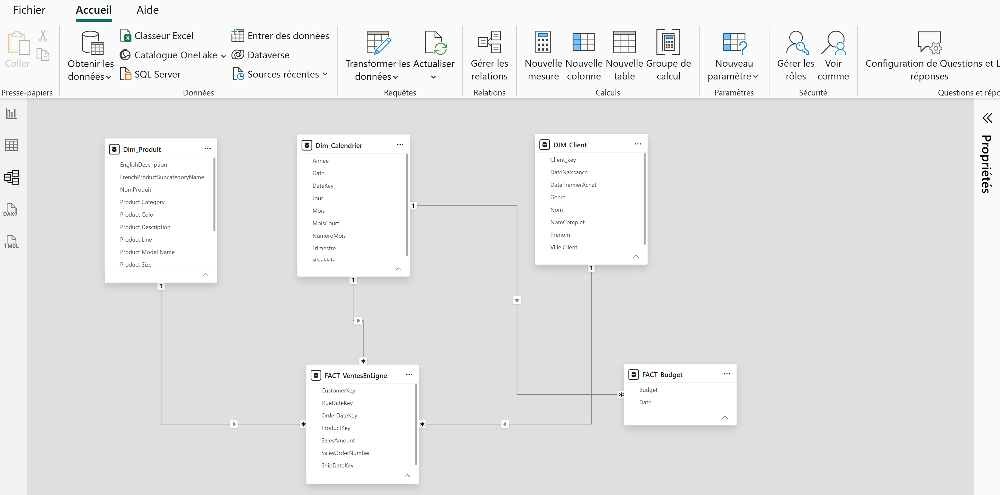
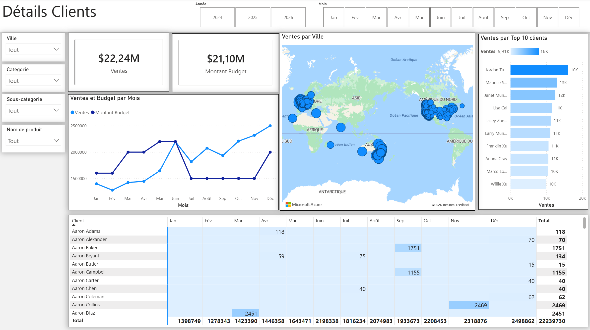
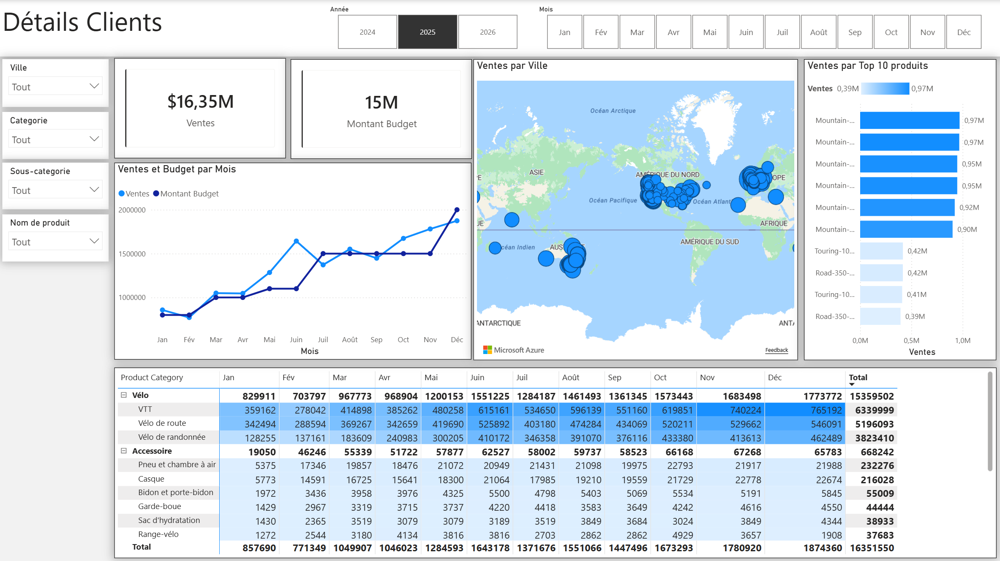

# 📊 Analyse des ventes en ligne 

> *Transformer des rapports de ventes statiques en un tableau de bord interactif permettant au Responsable des Ventes de suivre la performance des ventes (par produit, client et période) en comparaison avec le budget.*

---

## ⚙️ Type de projet

- [x] Analyse SQL / Requêtage
- [x] Nettoyage de données
- [x] Dashboard / Visualisation de données
- [x] Bout en bout (recueil du besoin → données → dashboard)

---

## Table des matières
1. [Vue d'ensemble du projet](#1-vue-densemble-du-projet)
2. [Besoin métier & User Stories](#2-besoin-métier--user-stories)
3. [Objectifs](#3-objectifs)
4. [Périmètre & Outils](#4-périmètre--outils)
5. [Structure du repository](#5-structure-du-repository)
6. [Flux de données](#6-flux-de-données)
7. [Nettoyage des données et Transformation des données (SQL)](#7-nettoyage-des-données-et-transformation-des-données-sql)
8. [Modèle de données](#8-modèle-de-données)
9. [Tableau de bord - suivi des ventes en lignes](#9-tableau-de-bord---suivi-des-ventes-en-lignes)

---

## 1. Vue d'ensemble du projet

**Contexte :** La demande métier de ce projet est un rapport exécutif de ventes destiné aux responsables commerciaux. Les rapports de ventes internet existants sont statiques et ne permettent pas un suivi dynamique de la performance commerciale.

**Problème :** Impossible de répondre rapidement à des questions simples mais essentielles — combien a été vendu, de quels produits, à quels clients, comment cela évolue dans le temps, et comment ces résultats se comparent au budget.

**Approche :** Recueil structuré du besoin métier sous forme de user stories, restauration et nettoyage de la base AdventureWorksDW (SQL Server), modélisation en étoile, puis construction d'un dashboard Power BI intégrant les ventes réelles et le budget.

**Résultat :** Un tableau de bord interactif filtrable par produit, client et période, comparant ventes réelles et budget mois par mois.

---

## 2. Besoin métier & User Stories

La demande métier pour ce projet d'analyse de données était un rapport exécutif de ventes destiné aux responsables commerciaux. Sur la base de cette demande, les user stories suivantes ont été définies pour cadrer la livraison et garantir le respect des critères d'acceptation tout au long du projet.

### Vue d'ensemble de la demande

| Élément | Détail |
|---|---|
| **Rapporteur** | Responsable des ventes (Sales Manager) |
| **Valeur du changement** | Tableaux de bord visuels et amélioration du suivi des ventes |
| **Systèmes nécessaires** | Power BI, CRM |
| **Autres informations utiles** | Budget: fichier séparé au format Excel |

### Récits utilisateur (User Stories)

| N° | En tant que | Je souhaite | Afin que | Critères d'acceptation |
|---|---|---|---|---|
| 1 | Responsable des ventes | Obtenir une vue d'ensemble des ventes en ligne via un tableau de bord | Mieux identifier les clients et produits qui se vendent le mieux | Dashboard Power BI dont les données sont mises à jour quotidiennement |
| 2 | Représentant commercial | Une vue détaillée des ventes en ligne par Client | Suivre les clients performants et ceux à développer | Dashboard filtrable par client |
| 3 | Représentant commercial | Une vue détaillée des ventes en ligne par Produit | Suivre les produits les plus vendus | Dashboard filtrable par produit |
| 4 | Responsable des ventes | Un aperçu de l'évolution des ventes par rapport au budget | Suivre l'évolution des ventes dans le temps | Dashboard avec graphiques et KPI comparant résultats et budget |

---

## 3. Objectifs

- **Objectif principal :** Construire un dashboard Power BI permettant de suivre les ventes internet par produit, client et période, en comparaison avec le budget.
- **Objectif secondaire 1 :** Nettoyer et fiabiliser les données sources (dates, statuts produits, doublons potentiels) avant modélisation.
- **Objectif secondaire 2 :** Construire un modèle de données en étoile reliant ventes réelles et budget suivi de la conception finale du tableau de bord interactif.  

---

## 4. Périmètre & Outils

### Périmètre

| Dimension | Détail |
|---|---|
| **Inclus** | Ventes internet (`FactInternetSales`) d'AdventureWorksDW, dimensions Produit/Client/Date, budget externe |
| **Exclu** | `FactResellerSales` (ventes via revendeurs) — non retenu car hors du périmètre défini par la demande initiale |
| **Période couverte** | 2 dernières années 2024 - 2026 (données actualisées depuis les dates d'origine 2010-2014 jusqu'à 2026) |
| **Granularité** | Transaction pour les ventes réelles ; mensuelle/catégorie pour le budget |

### Outils utilisés

| Catégorie | Outil(s) |
|---|---|
| Stockage des données | SQL Server (AdventureWorksDW) |
| Traitement des données | T-SQL |
| Visualisation | Power BI Desktop, Power Query, DAX |

---

## 5. Structure du repository

```
sales-management-data-analysis/
│
├── data/
│   └── budget/
│       └── budget.xlsx             # Fichier budget externe
│
├── queries/
│  ├── 01_Script_For_Update_AdventureWorks_Database.sql        
│  ├── 02_Dim_Calendrier.sql    
│  ├── 03_Dim_Client.com    
│  ├── 04_Dim_Produit.sql    
│  └── 05_Fact_VentesEnLigne        
│   
├── visuels/
│   ├── Details_clients.png
│   ├── Details_produits.png
│   ├── Modelisation_etoile.png   
│   └── VueEnsemble_dashboard.png   
│       
└── README.md
```

---

## 6. Flux de données

```
AdventureWorksDW (SQL Server) + Fichier Budget (Excel)
      ↓
Restauration base + mise à jour des dates (script SQL)
      ↓
Nettoyage & transformation (T-SQL : DimProduct, DimCustomer, DimDate)
      ↓
Import dans Power BI (Power Query) + intégration du budget
      ↓
Modélisation en étoile + mesures DAX
      ↓
Dashboard interactif (filtres produit / client / vendeur / période)
```

1. **Source :** Base AdventureWorksDW restaurée sur SQL Server ; fichier budget au format Excel fourni séparément.
2. **Mise à jour :** Les dates de la base (2010-2014 à l'origine) ont été décalées vers la période actuelle via un script T-SQL.
3. **Nettoyage :** Sélection des colonnes utiles, traduction des statuts produits, construction d'une colonne mois abrégé fiable pour le tri chronologique.
4. **Transformation :** Jointures Produit ↔ Sous-catégorie ↔ Catégorie ; intégration du budget comme table séparée.
5. **Analyse :** Construction de mesures DAX (ventes réelles, écart au budget, évolution mensuelle).
6. **Sortie :** Dashboard Power BI avec filtres interactifs.

---

## 7. Nettoyage des données et Transformation des données (SQL) 

Pour créer le modèle de données nécessaire à l'analyse et à la satisfaction des besoins métiers définis dans les récits utilisateurs, les tables suivantes ont été extraites et nettoyées à l'aide de SQL.

Une source de données (budget des ventes) a été fournie au format Excel et a été connectée au modèle lors d'une étape ultérieure du processus, directement dans Power BI.

Vous trouverez ci-dessous les instructions SQL utilisées pour nettoyer et transformer les données nécessaires.

### `DIM_Calendrier`
```sql
-- Nettoyage DimDate Table
SELECT 
  [DateKey], 
  [FullDateAlternateKey] AS Date, 
  [FrenchDayNameOfWeek] AS Jour, 
  --,[DayNumberOfMonth]
  --,[DayNumberOfYear]
  [WeekNumberOfYear] AS WeekNbr, 
  -- [EnglishMonthName] AS Month,
  --,[SpanishMonthName] 
  [FrenchMonthName] AS Mois, 
  CASE MonthNumberOfYear
    WHEN 1 THEN 'Jan' WHEN 2 THEN 'Fév' WHEN 3 THEN 'Mar' WHEN 4 THEN 'Avr'
    WHEN 5 THEN 'Mai' WHEN 6 THEN 'Juin' WHEN 7 THEN 'Juil' WHEN 8 THEN 'Août'
    WHEN 9 THEN 'Sep' WHEN 10 THEN 'Oct' WHEN 11 THEN 'Nov' WHEN 12 THEN 'Déc'
   END AS MoisCourt, 
  [MonthNumberOfYear] AS NumeroMois, 
  [CalendarQuarter] AS Trimestre, 
  [CalendarYear] AS Annee 
FROM 
  [AdventureWorksDW2025].[dbo].[DimDate] 
WHERE 
  CalendarYear >= 2024
```

### `DIM_Clients`
```sql
-- Nettoyage Dim_Customers Table -- 
SELECT 
  c.CustomerKey AS Client_key, 
  -- ,[GeographyKey]
  -- ,[CustomerAlternateKey]
  -- ,[Title]
  c.FirstName AS Prenom, 
  -- ,[MiddleName]
  c.LastName AS Nom, 
  c.FirstName + ' ' + c.LastName AS NomComplet,   -- Concatener le prénom et le nom. 
  c.BirthDate AS DateNaissance, 
  CASE c.Gender WHEN 'M' THEN 'Homme' WHEN 'F' THEN 'Femme' END AS Genre, 
  c.DateFirstPurchase AS DatePremierAchat, 
  -- ,[CommuteDistance]
  g.City AS VilleClient   -- Joindre la ville du client depuis la table Geography 
FROM 
  dbo.DimCustomer AS c 
  LEFT JOIN dbo.DimGeography AS g ON g.GeographyKey = c.GeographyKey 
ORDER BY 
  CustomerKey ASC -- Ordonner la liste par CustomerKey
```

### `DIM_Produits`

```sql
SELECT 
  p.ProductKey, 
  p.[ProductAlternateKey] AS ProduitItemCode, 
  p.[EnglishProductName] AS NomProduit, 
  ps.FrenchProductSubcategoryName, 
  -- Jointure à partir de la table Sub Category 
  ps.FrenchProductSubcategoryName AS [Sub Category], 
  pc.FrenchProductCategoryName AS [Product Category], 
  -- Jointure à partir de la table Category 
  p.[Color] AS [Product Color], 
  p.[Size] AS [Product Size], 
  -- ,[SizeRange]
  -- ,[Weight]
  -- ,[DaysToManufacture]
  p.[ProductLine] AS [Product Line], 
  p.[ModelName] AS [Product Model Name], 
  -- ,[LargePhoto]
  p.[EnglishDescription], 
  p.[FrenchDescription] AS [Product Description], 
  CASE WHEN p.Status = 'Current' THEN 'Actif' WHEN p.Status IS NULL THEN 'Obsolète' ELSE p.Status END AS [Product Status] 
FROM 
  dbo.DimProduct AS p 
  LEFT JOIN dbo.DimProductSubcategory AS ps ON ps.ProductSubcategoryKey = p.ProductSubcategoryKey 
  LEFT JOIN dbo.DimProductCategory AS pc ON ps.ProductCategoryKey = pc.ProductCategoryKey 
ORDER BY 
  p.ProductKey asc
```
### `FACT_VentesEnLigne`

```sql
SELECT [ProductKey]
      ,[OrderDateKey]
      ,[DueDateKey]
      ,[ShipDateKey]
      ,[CustomerKey]
      ,[SalesOrderNumber]
      ,[SalesAmount]
  FROM [dbo].[FactInternetSales]
  WHERE 
  LEFT(OrderDateKey, 4) >= YEAR(GETDATE()) - 2  -- Nous assurer de toujours récupérer les données des 2 dernières années lors de l'extraction  
  ORDER BY 
    OrderDateKey ASC 
```

## 8. Modèle de données

Le modèle de données ci-dessous a été construit dans Power BI après import des tables nettoyées via SQL. Il montre notamment comment `FACT_Budget` a été connecté à `FACT_InternetSales` et aux tables de dimensions nécessaires (`DIM_Calendar`, `DIM_Products`), via la relation sur la date.



**Tables du modèle :**

| Table | Rôle | Champs principaux |
|---|---|---|
| `FACT_VentesEnLigne` | Table de faits — ventes réelles | `CustomerKey`, `ProductKey`, `OrderDateKey`, `SalesAmount` |
| `FACT_Budget` | Table de faits — budget prévisionnel | `Budget`, `Date` |
| `DIM_Calendrier` | Dimension temporelle | `Date`, `Mois`, `MoisCourt`, `Quarter`, `Annee` |
| `DIM_Clients` | Dimension client | `ClientKey`, `FullName`, `VilleClient`, `Genre` |
| `DIM_Produits` | Dimension produit | `ProductKey`, `NomProduit`, `ProductCategory`, `ProductStatus` |

## 9. Tableau de bord - suivi des ventes en lignes  

Le tableau de bord final comporte trois pages : une page **Vue d'ensemble** servant de synthèse générale, et deux pages de détail permettant d'explorer les ventes par **Client** et par **Produit**.

### Vue d'ensemble des ventes


## Détails Clients

Filtrable par ville, catégorie, sous-catégorie et produit — permet de suivre la performance par client mois par mois.



## Détails Produits

Répartition des ventes par catégorie et sous-catégorie de produit, avec suivi mensuel.



---
